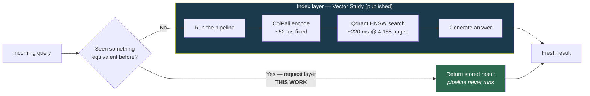
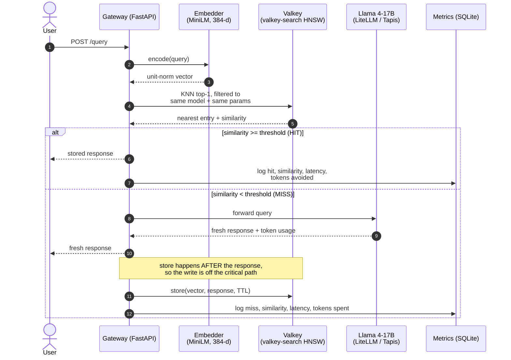
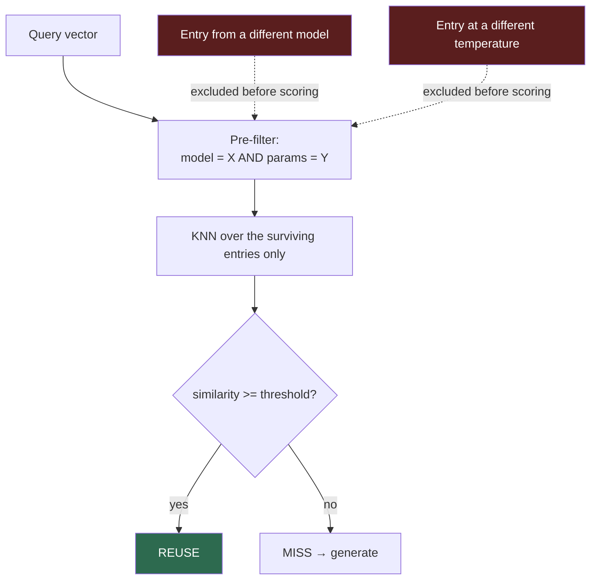
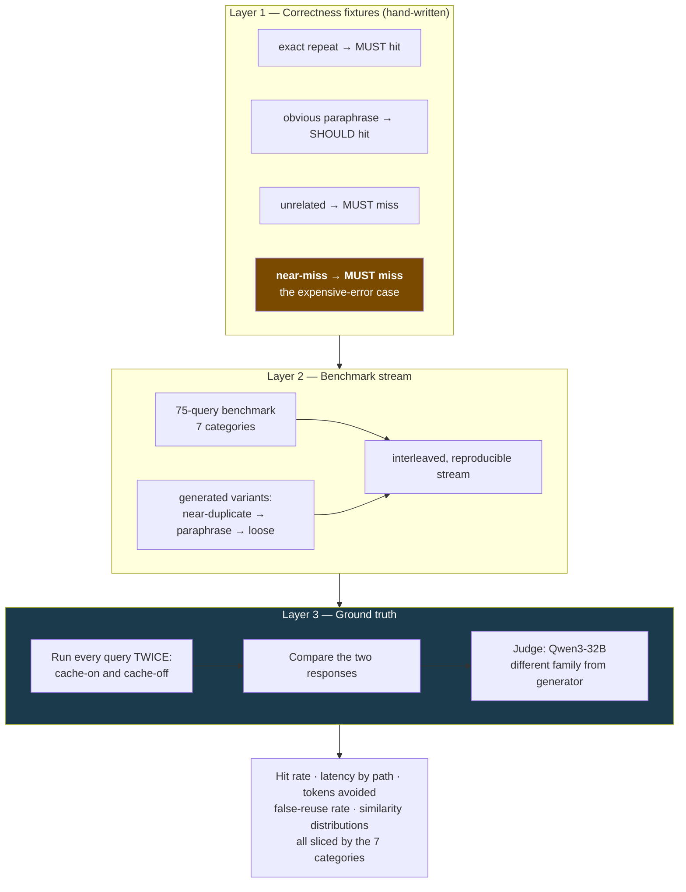
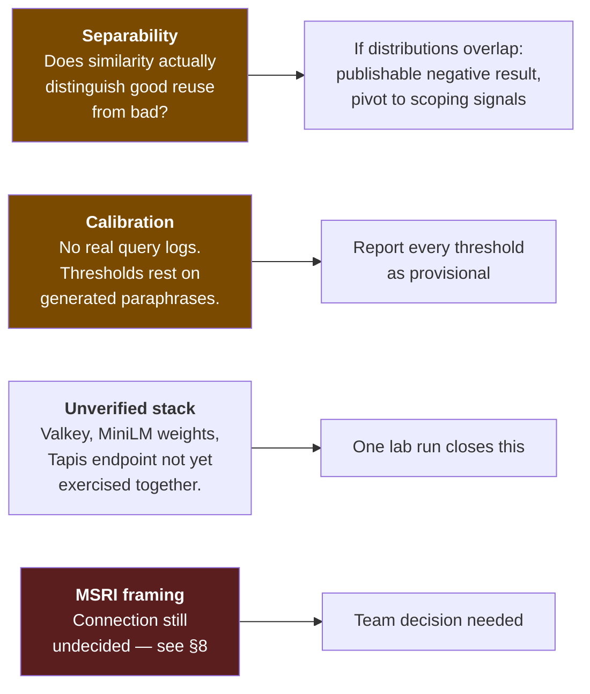
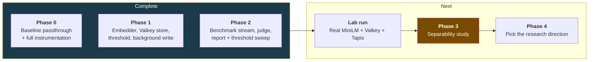
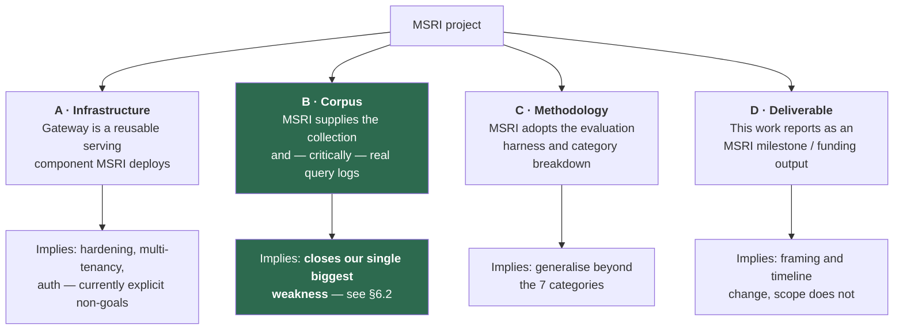

# Semantic Result Reuse — Team Briefing

**Status:** POC built, Phases 0–2 complete on fakes. Awaiting a real measurement run on lab hardware.
**Repo:** `nee1k/embedding_study` — PR #1
**Companion work:** `vector-volume-discovery-eval` (Vector Study), `patra-metadata-augmentation-study`

---

## 1. The one-sentence version

The Vector Study made each query **cheaper to answer**. This work makes us **answer fewer queries at all** — if a new query means the same thing as one we already served, we return the stored result instead of running the pipeline.

---

## 2. Why this is a separate contribution, not an optimization

These are two different levers on the same cost, and they compose.



- **Index layer (done):** HNSW, on-disk memmap, binary quantization → sub-linear latency growth.
- **Request layer (this work):** skip the box entirely on a semantic repeat.

The research claim that ties both papers together: **characterise the joint effect.** Are the savings additive? Where is the crossover as the corpus grows? Neither paper alone answers that.

---

## 3. How it actually works

### 3.1 The request path



**The detail that matters on line 8:** the similarity is recorded **even when the nearest entry loses**. More on why in §4.

### 3.2 Two design decisions worth the team's attention

**(a) Reuse is scoped, not just thresholded.**

Similarity alone never authorises reuse. An entry is only a *candidate* if it came from the same model with the same generation parameters — enforced as a tag pre-filter inside the vector search, not as an afterthought.



Without this, a cache hit could silently serve a result generated under settings the caller never asked for. Tests cover reuse breaking when either the model or the temperature changes.

**(b) Log the similarity, decide the threshold later.**

Because we record the top-1 similarity on *every* request — hits and misses alike — we can recompute "what would the hit rate have been at threshold *t*?" from data we already have, without spending a single extra inference call.

> **Honest caveat, and it belongs on the slide:** the sweep holds cache *contents* fixed at whatever that run actually stored. A different threshold would have stored a different set of entries. So the sweep is a **counterfactual estimate for narrowing the search**, not a substitute for re-running at the chosen threshold. The report prints this caveat in its own output.

---

## 4. What we measure, and why that shape



**Near-miss pairs are the ones to watch.** These are written by hand, not generated, because a generator does not reliably produce genuine near-misses. Examples in the suite:

| Primed with | Probed with | Must |
|---|---|---|
| "What is a deadlock?" | "How do you **prevent** a deadlock?" | MISS |
| "**Time** complexity of quicksort?" | "**Space** complexity of quicksort?" | MISS |
| "**Advantages** of paging?" | "**Disadvantages** of paging?" | MISS |

One word apart, materially different answer. This is where a semantic cache earns or loses its credibility.

---

## 5. The benefits

| Benefit | Mechanism | Status |
|---|---|---|
| **Latency** | A hit skips search + generation entirely | Instrumented; hit vs miss paths reported separately |
| **Cost** | Tokens not spent on hits, reported as the primary unit | Instrumented; dollars derived from a configurable rate |
| **Composability** | Orthogonal to index-layer gains — stacks with the Vector Study | The joint-effect study is the strongest venue framing |
| **Operational simplicity** | Valkey gives HNSW + filtering + native key TTL in one process | No custom eviction code needed |
| **Honest measurement** | Cache-on and cache-off arms per run | Divergence is directly observable, not inferred |

**Where the hit-path floor sits.** Every request pays the embedding cost, so no hit can be faster than the embed leg. That is why we chose a small sentence embedder (MiniLM, 384-d, CPU) rather than reusing ColPali: ColPali's ~52 ms fixed encode would have become the floor on *every* hit. The report isolates the embed leg specifically so this is visible rather than assumed.

---

## 6. The challenges — stated plainly



**1. Separability is the real scientific risk.** The text-only caching literature reports that similarity score barely separates correct reuse from incorrect reuse. If that holds here, threshold tuning is a dead end. We have built the measurement to *detect* that rather than hope against it — and a clean negative result is publishable, redirecting the work toward auxiliary scoping signals (category, corpus version, session) instead of a better cutoff.

**2. We have no real user query logs.** Calibration rests entirely on generated paraphrases — precisely the setup the literature reports as failing on real query variation. Every threshold we report must carry that caveat. **This is the single biggest threat to the strength of any claim we make**, and it is worth asking in the meeting whether any source of real queries exists.

**3. The real stack is written but unexercised.** The build environment had no GPU, no Docker daemon, and no route to HuggingFace. Cache logic, scoping, TTL, metrics, and the full bench pipeline are verified against in-process fakes; Valkey, the MiniLM weights, and the Tapis endpoint have not yet run together. One session on lab hardware closes this.

**4. The fakes must never leak into results.** A bag-of-words embedder scores lexical overlap, not meaning. Non-reportability is marked in the code, in CLI output, and in the README, and the semantic-paraphrase fixture *skips* under the fake rather than falsely passing — but this is a discipline we have to keep.

---

## 7. What we have done so far



**Concretely, in the repo:** ~2,400 lines across gateway and bench harness, 26 files, **34 tests passing**, full pipeline runs end to end from a clean checkout with no GPU, Docker, or network.

**Resolved along the way** — three of the open questions from the original POC plan:

| Open question | Resolved to |
|---|---|
| "Tapas Lite LM" — what is it? | **Llama 4-17B via LiteLLM on TACC Tapis** — an OpenAI-compatible proxy, so the backend is a thin HTTP client, not a deployment |
| Vector store: Milvus or Valkey? | **Valkey.** `valkey/valkey-bundle` ships `valkey-search`: HNSW, cosine, tag filtering, native TTL — meets every requirement, so the Milvus fallback never triggered |
| Judge protocol | **Reused ours.** Qwen3-32B at temp 0.0, different model family from the generator — the same protocol as the patra metadata study, rather than inventing one |

**Reused rather than rebuilt:** the 75-query benchmark and its category labels come straight from the Vector Study. A quiet but real find — **the benchmark ships with ground-truth page ranges**. Unused by this text-in/text-out POC, but they are what would make reuse correctness *objectively* measurable in the retrieval-modality extension, with no LLM judge in the loop.

---

## 8. How this relates to MSRI — **decision needed**

**Flagging honestly:** the MSRI connection was listed as an open question in the original POC plan, and it is still open. It does not appear in any of the three related repos, and I could not establish it from the code or the literature. Rather than guess, here are the candidate framings for the team to choose between — this is the slide where we should actually decide.



**Worth noting which option carries the most technical weight:** if MSRI can supply **real query logs (B)**, that directly resolves the calibration problem in §6.2 — the one thing most limiting how strong our threshold claims can be. The other three change positioning; B changes what we can actually prove.

Each option also implies different scope. Option A in particular pulls in production hardening, which the POC currently lists as an explicit non-goal.

---

## 9. What we need from this meeting

1. **Decide the MSRI connection** (§8) — and specifically, **does MSRI give us real query logs?**
2. **Confirm the lab run** — who runs it, on what hardware, and are Tapis credentials in hand?
3. **Agree the Phase 4 direction is contingent**, not pre-chosen. Phase 3's separability result should pick it:
   - Distributions separate cleanly → **category-conditioned thresholds** (no published work conditions on query type)
   - Distributions overlap → **scoping signals over threshold tuning** (negative result, still publishable)
   - Either way → **the combined cost model** stays the strongest framing for a venue

---

## Appendix — running it

```bash
# Runs anywhere: no GPU, Docker, or network
pip install -r requirements.txt
pytest -q                                   # 34 tests
python -m bench.fixtures --fake             # correctness fixtures

# Lab machine: real stack
pip install -r requirements.txt -r requirements-lab.txt
docker compose up -d                        # valkey/valkey-bundle
cp .env.example .env                        # Tapis creds; switch impls to real
uvicorn gateway.app:create_app --factory --port 8080

python -m bench.paraphrase --method llm     # FIRST: regenerate real variants
python -m bench.run_stream --out runs/phase2.sqlite --run-id phase2
python -m bench.judge  --db runs/phase2.sqlite --run-id phase2 --method llm
python -m bench.report --db runs/phase2.sqlite --run-id phase2
```

> The committed `paraphrases.json` is template-generated for harness testing. Regenerating it with `--method llm` is the first real step — nothing measured before that means anything.
